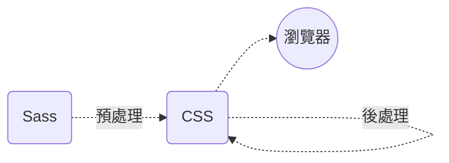

## 前言

在上一篇文章中[那些發生在 CSS 之「前」的魔法 —— 預處理器](https://www.tridong.com/post/tutorial/the-magic-before-css-preprocessors/)，我們探討了 CSS 預處理器，並了解為什麼需要使用「 CSS 處理器」。這次讓我們來了解後處理器，特別是 *PostCSS* 能夠為你幫上什麼忙！文章主要會探討以下幾個重點 (附帶範例)：

* ✔️ 提供什麼好處、為什麼需要它們？
* 🔎 有哪些後處理器可以選擇？
* ❌ 或許不應該使用後處理器的原因

以下是關係圖表，在開始之前可以回顧一下後處理器的位置。

## 使用後處理器的理由

後處理器會把現有的 CSS 檔案解析後處理，實現某些功能。例如自動添加 Vendor Prefix ([Prefixfree](https://projects.verou.me/prefixfree/))或使用最新的語法([Stylecow](https://stylecow.github.io/))。不過在本文中會主要舉例 PostCSS，並了解它有什麼獨特之處。
## PostCSS — 借助 Javascript 之力處理 CSS
PostCSS 幾乎是後處理器的代名詞，不過實際上這個名詞並不太準確，因為它實際上可以預處理，也能後處理。這樣尷尬矛盾的命名它們 [Twitter](https://twitter.com/PostCSS/status/626046993006239744) 上也提到過。

簡單來說，PostCSS 讓你用 Javascript 插件*自動化處理你的 CSS*，只要想得到的功能，都能在 PostCSS 插件庫([PostCSS.part](https://www.postcss.parts/))中找得到，舉例來說：
* 用全新的方式撰寫 CSS ([Tailwind CSS](https://tailwindcss.com/docs/installation/using-postcss))
* 壓縮現有檔案 ([CSSnano](https://cssnano.co/))
* 自動添加 Vendor Prefix ([Autoprefixer](https://github.com/postcss/autoprefixer))
* 立即使用最新出爐的語法 ([postcss-preset-env](https://preset-env.cssdb.org/))
* 提醒語法上的錯誤並修正 ([Stylelint](https://stylelint.io/))

## 參考資料
* 